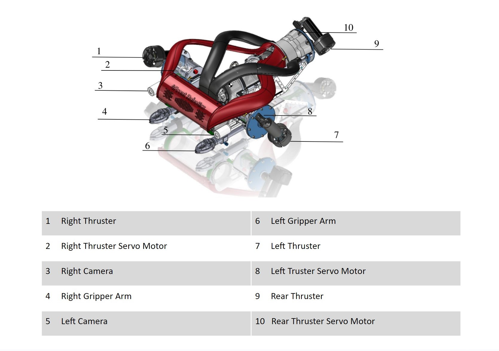
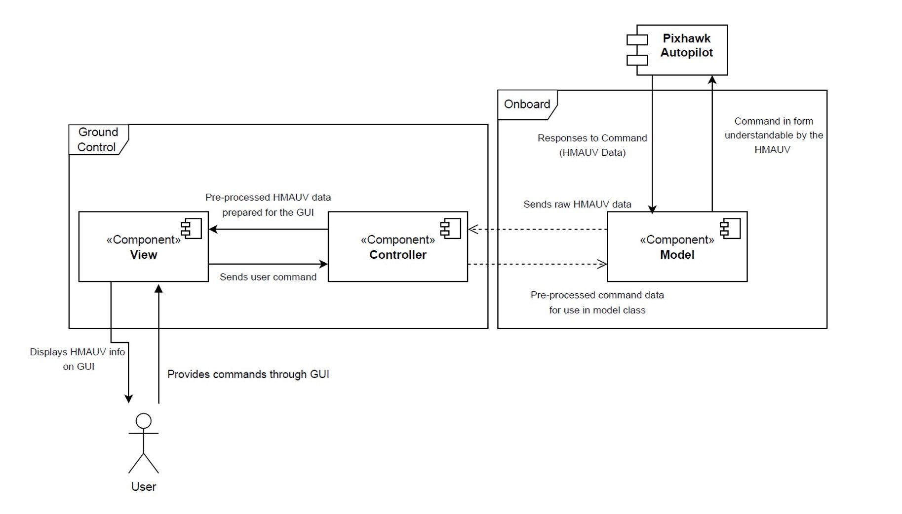
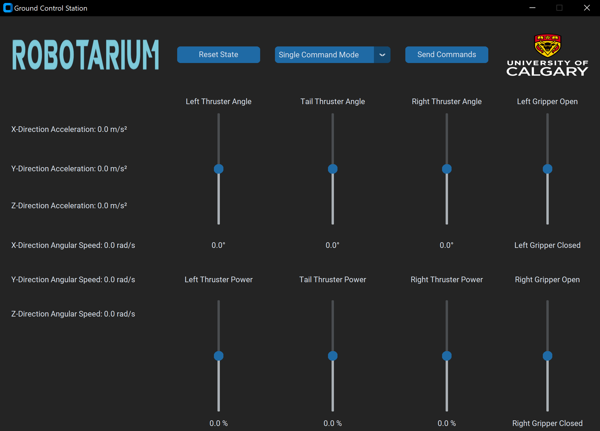
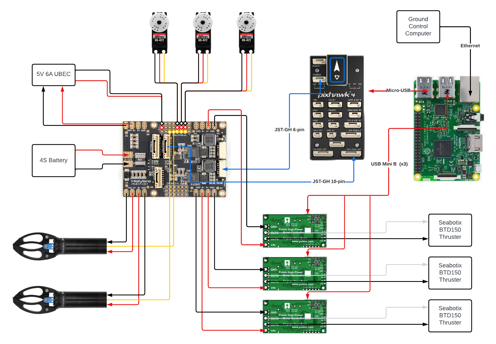

# Unmanned Underwater Vehicle

## Project Overview
This research project involves designing and implementing a software/hardware integration to provide underwater drone control for Unmanned Vehicles Robotarium research lab. Our team successfully integrated various electronic components and developed software to control the underwater drone. We had developed a GUI using Python that is capable of communicating with a Raspberry Pi and PX4 flight controller to send commands and read movement data. The project consists of a custom GUI, a Raspberry Pi 3 Model B, Pixhawk 4 autopilot, a drone prototype, and a list of other various electronic components. The project’s main objective is deploying and navigating the drone prototype within confined underwater spaces.

## Vehicle Overview

## Software System

- **Model**: contains logic, calculations, and direct command communication with the HMAUV
- **View**: user interface to display data and receive commands from the user
- **Controller**: processes command data and relays such data between Model and View
- **Client/Server**: architecture between Controller and Model modules

### Ground Control System (GCS)

The GCS has seven user interface components:
- Thruster angle sliders
- Thruster RPM sliders
- Open/close gripper sliders
- Reset State button
- Command Mode dropdown
- Send Commands button
- IMU data display (acceleration and angular speed in x, y, and z directions)

### Software Operation

- Python 3.8 is required on GCS.
- Required packages: customtkinter, numpy, Pillow.
- RPi requires pymavlink, smc (currently inoperable), MAVProxy.

## Electronic System

| Component                   | Rating                             |
| --------------------------- | ---------------------------------- |
| Seabotix Thruster           | 110W Max, 80W Continuous           |
| Hitec HS422 Servo Motor     | 5W (4.8-6V, 0.8A)                  |
| Subsea Gripper              | 108W                               |
| Pixhawk 4                   | 12.5W USB Supply                   |
| Pololu Motor Controller     | 15W                                |
| HolyBro PM07-V21 Board      | 45W                                |
| Raspberry Pi 3B             | 12.5W USB Supply                   |
| BlueRobotics LiPo Battery   | 14.8V, 15.6Ah                      |

## Installation Instructions

To learn more about the project, install the hardware, and run the software, please see our [User Manual.](./User%20Manual.pdf)

